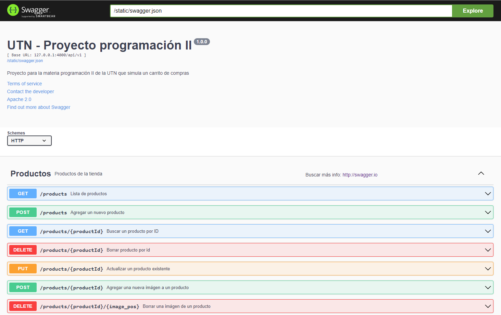
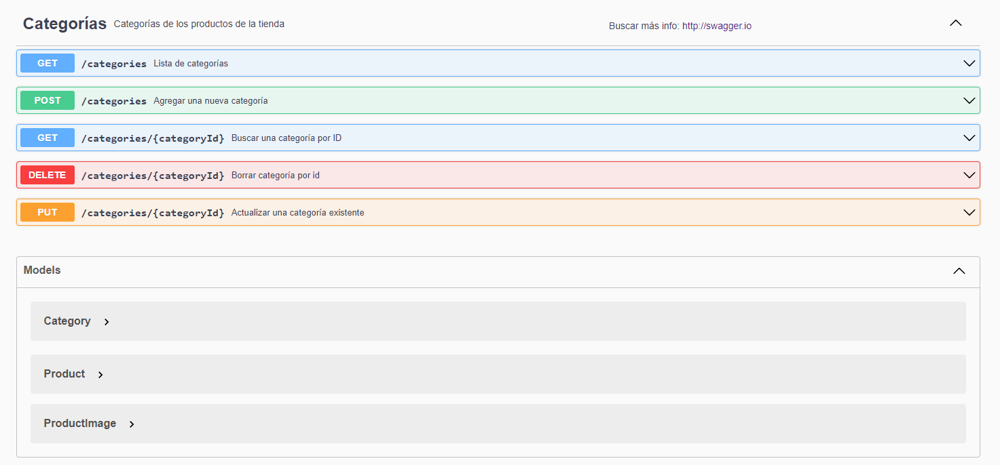
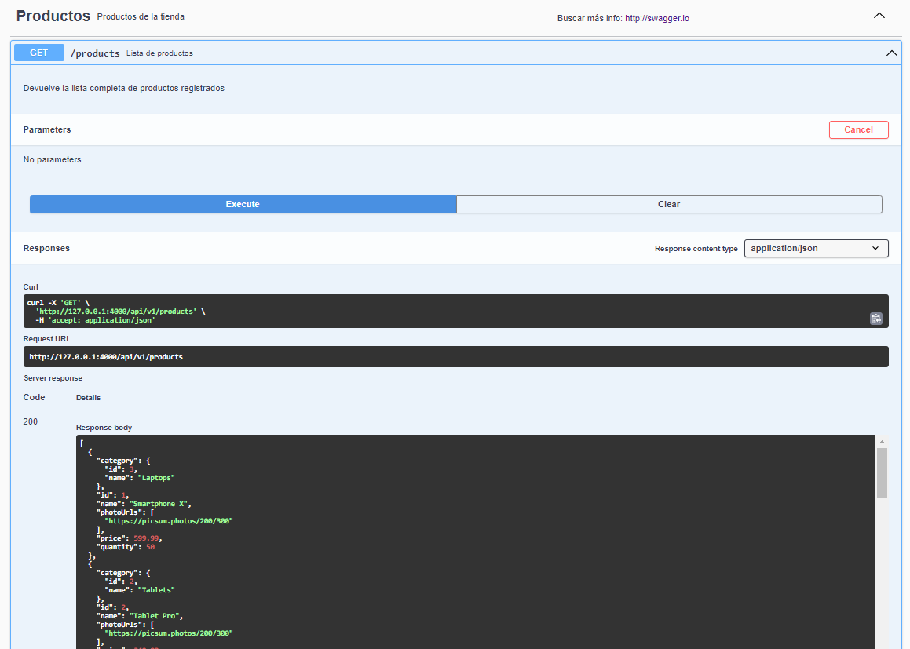

# Proyecto API - Programación II UTN
### Instalación de librerías
Ejecutar el comando: <br>
```console
pip install -r requirements.txt 
```

### Ejecución de la API
Ejecutar el comando: <br>
```console
py app.py
``` 
<br><br>
El servidor debe ejecutarse en el host: <br>
http://127.0.0.1:4000

### Screenshots



